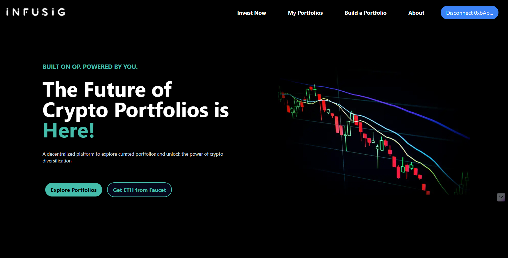
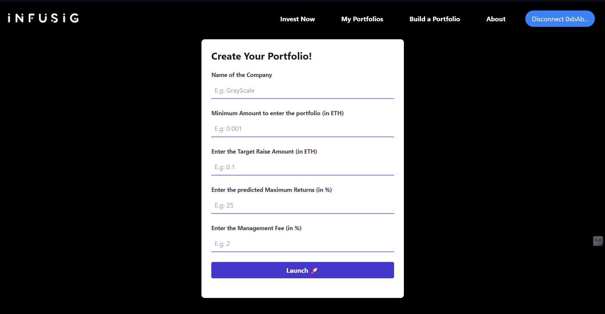
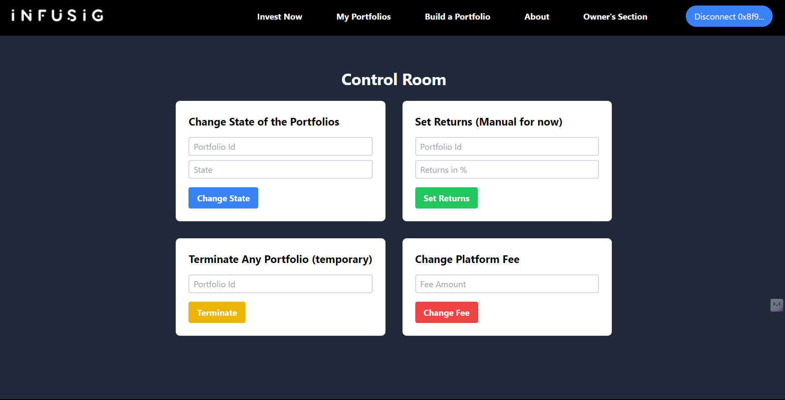

# **Infusig** - Build and Invest in Curated Crypto Portfolios

Tired of opaque investment strategies and hidden fees?  **Infusig** empowers you to take control of your crypto future with a revolutionary approach: ***decentralized, code-powered crypto portfolios.***

Our platform leverages the security and transparency of the Optimism (OP) network. All investment strategies are built on open-source smart contracts, allowing you to verify every step of the process. This means no blind faith, just secure, verifiable investing.

Also, this project is under development but still there's much to try out. I can really think of some great features which will make it insanely good. We will discuss about it as we deep dive into the README.

Built and launched during [Backdrop Build V3](https://backdropbuild.com/)

## Visual Tour

**Home Page** - The landing page of the website. It's a simple page with several tabs to navigate different sections of the website with a button to connect your wallet, `Get you ETH from Faucet` button sends you to the faucet page where you can get some testnet ETH to try out the platform.

**Build a Portfolio** - This page allows to create new portfolios by filling the required details.

**My Portfolios** - This page shows the list of portfolios created by the user. Each portfolio contains some buttons to interact with the portfolio which will be discussed later.

**Invest Now** - This page shows the list of portfolios created by other users. You can invest in any of the portfolios by clicking on the `Invest` button. Or if feels like withdrawing the investment, `Withdraw` button saves your day!

**Owner's Section** - This page is a secret one, only opened for the owner of smart contract. But still you can access it [here](https://infusig.vercel.app/owner), but not those buttons. We know why!

## Table of Contents

- [Infusig: A Solution for...](#infusig-a-solution-for)
- [Understanding Infusig: Features and Functionality](#understanding-infusig-features-and-functionality)
    - [Behind the Scenes](#behind-the-scenes)
    - [Functionality of the Website](#functionality-of-the-website)
- [My Experience with Backdrop](#my-experience-with-backdrop)
- [What I Learnt](#what-i-learnt)
- [Contributing](#contributing)

### Infusig: A Solution for...

Ever since the Crypto boom of 2017, the world has been fascinated by the potential of Cryptocurrencies and blockchain technology. Some were interested in the technology itself like how it works and shapes the world in its magical realm, while others were drawn towards the investment opportunities it presented. But the problem with the crypto investment is that it's not as easy as it seems. It's not just about buying and selling, it's about understanding the market, the technology, the trends, and the risks. Many earned a fortune, while many lost everything they had. It's just like traditional stocks or shares market but with a twist of technology and decentralization.

In traditional markets, we have a concept of *Mutual Funds* where a fund manager (belonging to various mutual funds companies and organizations) manages the funds of the investors and invests in different stocks, bonds, and other securities. The investors don't have to worry about the market trends, the fund manager does that for them by charging a percentage of fee which varies. There are some centralized regulations which make sure that these fund manager aren't involved in any fraudulent activities and the investors' money is safe. But in the crypto world, there's no such thing. You are on your own. You have to manage your funds, invest in different coins and currencies and keep an eye on the market trends. And the worst is we can't really trust anyone because crypto is such a asset which is easily lost or can be run away with. So, what's the solution?

Why not create a decentralized platform where a smart contract is responsible for managing the funds, handling the [portfolios](https://www.investor.gov/introduction-investing/investing-basics/investment-products/mutual-funds-and-exchange-traded-1) created by managers, and take care whether someone is trying to do something fishy. Of course, we can trust smart contracts because they are open-sourced and easily verifiable. One can easily invest in whatever portfolio he feels like and can withdraw the investment whenever he wants. This platform does consist of an owner but its powers are mostly limited and is useful for handling disputes and critical decision-making!

## Understanding Infusig: Features and Functionality

This section will describe the actual working of ***Infusig***, how it works and what features it provides. There will be two parts of this section, first will cover the details about the platform, its working and the second will generally cover the functionality of the website, its pages and how to use it. I do made some notes while planning and building this project which are provided [here](https://www.evernote.com/shard/s569/sh/e5640434-4fde-69cb-b414-dfbf5ea23668/iZ9EFkW0A4cuUE7mRUy9PcIekvLTdjHroDWSJ5pW1kVAFte5Ycas8wyVKA). You can check them out but they are really messy and unorganized with some details and how my plans changed, what I thought and what I did.

Anyways let's get started!

### Behind the Scenes

This platform works in many stages, and there are many rules that both investors and managers need to keep in mind. Now, let's discuss those stages one by one.

1. ***Creating a Portfolio***: When a manager finally decided with his team of strategists and analysts that they are ready to create a portfolio, they do need to make sure of some things:

    - Each portfolio will have a unique ID, a name, and an address where the funds could be sent
    - One needs to state a **minimum investment amount** which is the minimum amount of asset one can invest in the portfolio. if you want it to keep open for all, just set it to 0
    - There's an option to set a **total funds cap** which is the capacity of this particular portfolio to hold assets. Well, this capacity can even be increased later by the portfolio managers if they feel a slight interest in investors but it won't be increased once the portfolio is closed for investors to invest in. Also, make sure this value won't ever be decreased, so plan wisely!
    - There are two deadlines which every portfolio manager needs to foretold while creating the portfolio. First is the **investment deadline** which is the last date for the investors to invest in the portfolio. And the second is the **portfolio deadline** which is the last date when the portfolio will return funds to the investors. However, there is no boundation for the portfolio manager to return the funds before the deadline, it all depends on his analysis and how he plans to keep up the highest returns which shows his credibility and expertise in the market. But if he fails to return the funds before the deadline, the smart contract will automatically return the funds to the investors.
    - There's an option to set a **management fee** which is the percentage of the total funds which the portfolio manager will take as a fee for managing the funds. This fee will be deducted from the returns of the investors when the portfolio is closed and the funds are returned to the investors. This fee is not deducted from the invested amount, so the investors don't have to worry about it. It's just a way to pay the portfolio manager for his hard work and expertise.
    - Now let's come to the most important and strategic move which every portfolio has to play, it's the value to be set in **maximum Return**. Here, the portfolio need to clear the investors how much maximum return they can expect from the portfolio. This value will be in percentage form, let's say 40%. Now, there are some things one needs to keep in mind when stating this value. Suppose, any portfolio sets 40% as his expected maximum return, then he needs to pay 40% of the total invested amount by the investors in advance to the smart contract. This is a way to show the investors that even if any portfolio tries to betray them, they will get back that 40% and thus be at no loss. And the portfolio company or organization will be blacklisted. So, it's a win-win situation for the investors. Also, this value can be changed later by the portfolio manager if he feels like he can provide more returns to the investors. And they need to pay again for the increased percentage. So, it's a strategic move and needed to be planned wisely.
    - There's one more thing which portfolio managers need to keep in mind which is also related to the above point. These portfolios will never be given any funds of the investors directly. All funds be poured down to the smart contract. That means, these portfolios do have to invest their own money or crypto for that trading stuff and also need to pay the amount as per their maximum returns. But, when the portfolio ends..they be paid back with both their funded amount as well as the fees generated by the investors. The next point explains it well with the help of an example...
    - Suppose, a portfolio collects around 100 ETH and believes to have a max. percentage of 50%, i.e. he is paying 50 ETH to the smart contract as a security and will invest his 100 ETH in the crypto market. Let's say the second deadline was 1 month later and the returns soar about 40%. Thus, that manager makes 140 ETH (100 + 40% of 100). Now, he will be returned that 10% (50% - 40%) ETH which he paid in advance + the fees generated by the investors. All the investors will receive the increased returns of their invested amount - the fees paid to the portfolio manager and the platform. So, it's a win-win situation for everyone. The portfolio manager gets his fees, the platform gets its fees and the investors get their returns.

2. ***Investing in a Portfolio***: When an investor decides to invest in a particular portfolio, he needs to take care of some things:

    - Do check what's the minimum amount limit for a certain portfolio. If you are investing less than that, you won't be able to invest in that portfolio.
    - Also, do check the total funds' cap. If the portfolio is already full, you won't be able to invest in that portfolio.
    - As I do mentioned about two deadlines, the investor needs to keep in mind the investment deadline. If he invests after the investment deadline, he won't be able to invest in that portfolio.
    - Also make sure that if any investor thoughts of withdrawing their crypto or money before the first deadline, then he will be paying up the platform fees. but if he decides to withdraw the time when all these funds were been invested in the market, then he will be getting the returns on that current market state and also do need to pay both platform and manager fees. So, always plan ahead!

3. ***First Deadline Hits***: As soon as the first deadline hits, there will be a time given to the portfolio manager to pay the amount according to the maximum return he declared and the amount that got collected by his portfolio. If he fails to pay the amount, the smart contract will automatically return the funds to the investors and the portfolio will be closed and that portfolio company and organization will be blacklisted. But if he pays the amount, the portfolio manager can start investing the funds in the market and the investors will be able to see the returns on their invested amount. Make sure that investors can't really withdraw in that phase when the first deadline hits and the funds are been left to be paid by the portfolio manager.

4. ***Trading Phase***: This is the phase when the portfolio manager invests the funds in the market. He will be investing in those assets which he mentioned in the portfolio and investors can take a look at the market trends and their returns on the invested amount with the help of APIs integrated into the platform itself (Although, this feature will be added later). If, in any case, some investors feel that they didn't get the specific returns which were shown in the portfolios i.e suppose that company or organization tries to betray the investors by investing in cryptos or coins which weren't mentioned in the portfolio or there's an inappropriate proportion in which the assets were invested in, In these cases the investors can raise a dispute against a certain owner and if found true, the smart contract will return all the funds and extra returns (presented by portfolio manager as per his maximum returns in the form of advance) to the investors and the portfolio will be closed and that portfolio company and organization will be black listed.

5. ***Second Deadline Hits***: As soon as the second deadline hits, the portfolio manager needs to return the funds to the investors. If he fails to do so, the smart contract will automatically return the funds to the investors and the portfolio will be closed and that portfolio company and organization will be blacklisted. But if he returns the funds, the portfolio will be closed and the investors will get their returns on the invested amount. Also, the platform and the portfolio manager will get their fees. But there's no compulsion to return the funds exactly on that deadline. One can easily return the funds before the deadline if he feels that this is the right time.

### Functionality of the Website

By looking at the above section, this will be a piece of cake for you to understand the functionality of the website. But still, let's discuss it in a bit more detail.

1. ***Invest Now Tab***: This tab will contain all the portfolios listed on the platform. These portfolios will contain several details like name, ID, min. amount to invest, max. Returns, total amount collected, total funds cap, investment deadline, portfolio deadline, management fee and a link to the company's actual portfolio which will contain a detailed overview of what assets that company is aiming for and why (This feature will be added later). Also, there are two buttons, `Invest` and `Withdraw`. The `Invest` button will be used to invest in a particular portfolio by entering the value in ETH. e.g. 0.001 ETH. The `Withdraw` button will be used to withdraw the investment from a particular portfolio. Also, there will be a tab where one can check the current returns provided by that portfolio which could be implemented with the help of APIs. But this feature will be added later.

2. ***My Portfolios Tab***: This tab will contain all the portfolios created by the user. These portfolios will also contain several functionalities as same as the `Invest Now` tab. But it has 4 different buttons, `change Max. Return` (value in percentage, e.g: 40), `change Total Funds` (Value in ETH), `Pay Amount` and `End Portfolio`. That `Pay Amount` option will be called in the time period between first deadline and before the trading gets started by the portfolio manager. Make sure, if the portfolio manager ends the portfolio after collecting the funds and before even the trading starts, then he will be penalised for that

3. ***Owner's Tab***: This tab contains 4 helper functions which do help in running this platform in a temporary way till we don't get deadlines and trading phases implemented within the platform. Those 4 buttons are:

    - **Change State**: This button is used by for changing the state of any particular portfolio by passing its id. It's like, as we have three phases like we discussed with deadlines - before the first deadline, between first deadline and until the portfolio manager pays his amount in advance, and the 2nd deadline. Thus, the states which revolve around these phases and thus really useful for owners to keep the platform running.
    - **Set Returns**: As we haven't implemented the trading phase, APIs integration yet. This button will be used to set the Returns manually, thus we can check the functionality of the platform.
    - **Terminate**: As the name suggests, this button will be used to terminate the platform. But make sure, this button will only be used in case of any dispute or fraudulent activities by the portfolio managers.
    - **ChangeFee**: This button is used to change the platform fees.

## My Experience with ***Backdrop***

It was my first time participating in a Backdrop Build and really enjoyed it. Although during this 3-4 weeks timespan I was engaged in two projects, one was `Nexbizn` - an NFT marketing platform, for encode hackathon based on the polkadot ecosystem which ended on 11 March and the other was backdrop build itself. So, Making `Infusig` in merely 8-9 days was pretty thrilling and adventurous in itself. Felt more good on the fact that I had been able to launch it right on the deadline and hit up the goals which this project was marked upon. However, features like Account abstraction, fiat transactions, API integration, portfolio management in a better way, and many more were not implemented due to less time plus their complexity. But still, the outcome is quite satisfying if not the best.

## What I Learnt

- **Time Management**: This is the daunting thing which one need to have a grip upon when building projects within some deadline. Sometimes felt loosing up the time when I was engaged in both projects and also had to manage my college stuff. But, being articulated with my plans and ideas really helped me to keep up with the deadlines and thus, I was able to launch the project right on time.
- **Habit of Noting down things**: It's the most worthy thing which I practiced during this project, writing down every note and idea which came to my mind related to this project even if seems crazy or weird. Usually, the mind becomes a cluttered place when we are engaged in multiple things and thus, we tend to forget things. But, noting down things really helps when we are building and saves our time and energy.
- **Adapt and Move (Advice)**: There be times, when you be feeling that this project is not going to be completed on time or you are not able to implement the features which you thought of. But, it's really important to adapt to the situation and move on. Just cut the things short, and launch the project. Atleast better than giving it up...

## Contributing

Contributions are welcome! If you have any ideas, suggestions, or bug reports, please open an issue or submit a pull request.
